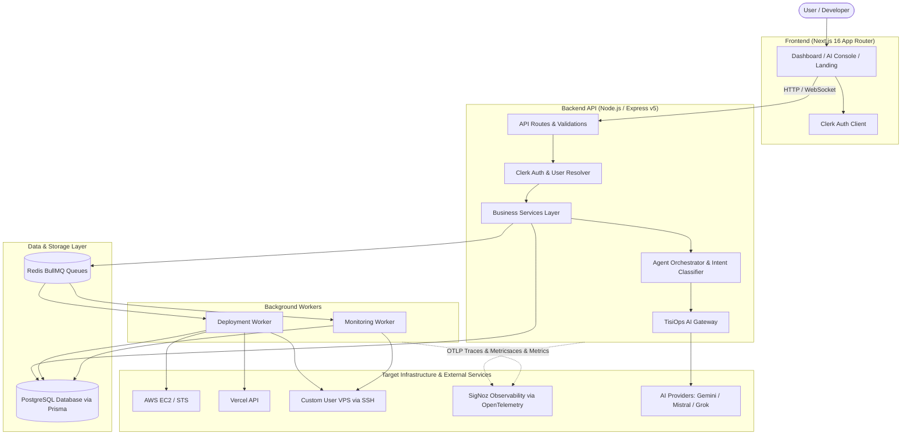
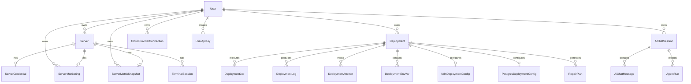
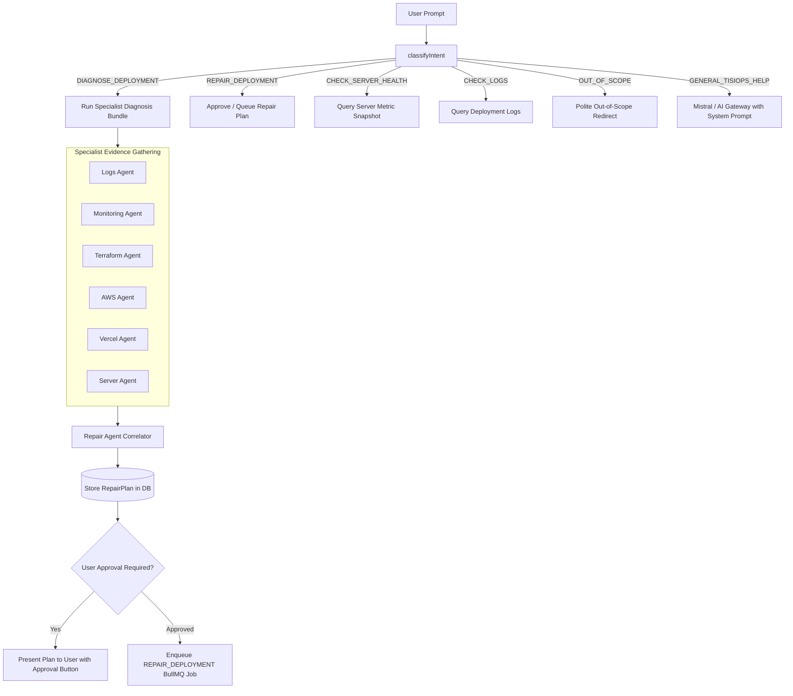
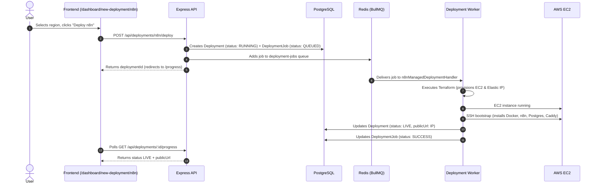
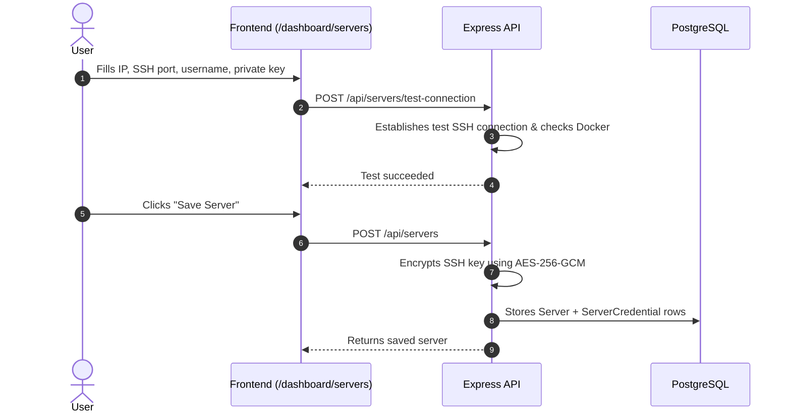

# TisiOps Codebase Architecture Guide

Welcome to the TisiOps codebase guide. This document explains how TisiOps is built, how every part connects, and how data and user requests move through the entire system.

---

## 1. What TisiOps Is

**TisiOps** is an AI-powered DevOps Platform-as-a-Service (PaaS). It allows developers to deploy, manage, monitor, diagnose, and repair infrastructure using both natural language (AI Console) and structured UI dashboards.

Instead of manually writing Terraform, configuring Docker, setting up Nginx, or troubleshooting server errors over SSH:
- A user asks TisiOps to deploy or manage an application.
- TisiOps analyzes the request, generates a clear and safe infrastructure plan, and asks for user approval.
- Once approved, background workers use fixed, verified Terraform modules and SSH scripts to provision servers, deploy containers, and configure networking.
- Continuous background monitoring collects telemetry (CPU, RAM, disk, Docker health).
- If something breaks, specialist AI agents diagnose the root cause from logs and telemetry and create a safe, one-click repair plan.

---

## 2. Architecture at a Glance

The diagram below shows how a user request travels across the system:



---

## 3. Repository Structure

TisiOps is structured as a TypeScript npm monorepo with two primary workspaces: `frontend` and `server`.

```text
TisiOps/
├── frontend/                  # Next.js 16 frontend application
│   ├── app/                   # App Router pages and route handlers
│   │   ├── dashboard/         # Protected dashboard views (deployments, servers, AI, admin)
│   │   ├── sign-in/           # Clerk authentication sign-in
│   │   ├── sign-up/           # Clerk authentication sign-up
│   │   ├── docs/              # Documentation pages
│   │   ├── layout.tsx         # Root layout (Clerk, Theme, Toast providers)
│   │   └── page.tsx           # Public landing page
│   ├── components/            # Reusable UI components
│   │   ├── admin/             # Admin console panels (AI gateway, templates, observability)
│   │   ├── dashboard/         # Dashboard widgets, server cards, deployment metrics
│   │   ├── deployment/        # Wizard modals, logs viewer, progress steppers
│   │   ├── landing/           # Landing page sections, hero, navbar, motion islands
│   │   ├── providers/         # Client context providers (SmoothScroll, Theme)
│   │   └── ui/                # Core UI primitives
│   ├── hooks/                 # Custom client React hooks
│   ├── lib/                   # Client utilities, API fetch helpers, auth utilities
│   └── package.json
│
├── server/                    # Express v5 API, workers, and infrastructure code
│   ├── auth/                  # Clerk server authentication and middleware
│   ├── db/                    # Prisma client singleton and generated types
│   ├── prisma/                # Database schema (schema.prisma) and migrations
│   ├── queues/                # Redis connection and BullMQ queue definitions
│   ├── services/              # Core business logic layer
│   │   ├── admin/             # Platform admin statistics
│   │   ├── agents/            # Orchestrator and specialist AI agents
│   │   ├── ai/                # Token usage calculation, rate limits, burst control
│   │   ├── ai-gateway/        # AI Gateway router, provider adapters, API key manager
│   │   ├── aws/               # AWS STS credential verification and EC2 helpers
│   │   ├── bootstrap/         # Server SSH bootstrapping scripts (Docker, n8n, postgres)
│   │   ├── deployments/       # Deployment lifecycle, overview, and state machines
│   │   ├── github/            # GitHub repo listing, analysis, and framework detection
│   │   ├── n8n/               # Managed n8n deployment planner and helpers
│   │   ├── observability/     # OpenTelemetry tracing, Prometheus metrics, SigNoz
│   │   ├── postgres/          # Managed PostgreSQL deployment planner and connection helpers
│   │   ├── provider-connections/ # Encrypted cloud credentials (AWS)
│   │   ├── servers/           # Server management, SSH diagnostics, monitoring, web terminal
│   │   ├── templates/         # YAML deployment templates and manifest parsers
│   │   ├── terraform/         # Terraform agent, inspection, drift detection, registry
│   │   └── vercel/            # Vercel deployment agent and API integration
│   ├── workers/               # Background BullMQ worker processes
│   │   ├── deployment.worker.ts # Primary deployment execution worker
│   │   ├── monitoring.worker.ts # Server monitoring installer and metrics collection worker
│   │   └── handlers/          # Specific job execution handlers
│   ├── infra/                 # Infrastructure as Code
│   │   └── terraform/         # Fixed Terraform modules (aws-n8n-server, aws-postgres-server, aws-app-server)
│   ├── validations/           # Zod validation schemas for all requests
│   ├── utils/                 # Cryptographic encryption/decryption, response formatters
│   ├── index.ts               # Express API entry point & route definitions
│   └── package.json
│
├── infra/                     # Local platform infrastructure
│   └── signoz/                # Docker Compose definition for SigNoz observability stack
│
├── AGENTS.md                  # Project rules and boundaries for AI coding assistants
├── CONTEXT.md                 # Product direction and roadmap scope
├── DESIGN.md                  # Visual design system (colors, typography, spacing)
└── package.json               # Root monorepo configuration
```

---

## 4. Application Components

| Component | Technology | Primary Responsibility |
| :--- | :--- | :--- |
| **Frontend** | Next.js 16, React 19, Tailwind CSS v4 | Renders the dashboard, AI Console, deployment wizards, terminal emulator, and landing page. |
| **Backend API** | Express v5, TypeScript | Handles HTTP requests, enforces Clerk authentication, validates input schemas, scopes queries by user ID, and manages database state. |
| **Database** | PostgreSQL, Prisma ORM v7 | Stores persistent source-of-truth records: users, servers, deployments, logs, AI sessions, and encrypted credentials. |
| **Message Queue** | Redis, BullMQ | Distributes asynchronous, long-running tasks (Terraform execution, SSH installs, metric polling) to workers. |
| **Deployment Worker** | BullMQ Worker (`deployment.worker.ts`) | Executes long-running infrastructure actions (Terraform apply/destroy, Vercel deployments, server restarts, repair actions). |
| **Monitoring Worker** | BullMQ Worker (`monitoring.worker.ts`) | Installs node-exporter/cAdvisor stacks on user servers and runs recurring metric collection jobs. |
| **AI Orchestrator** | Node.js / Custom Service | Classifies user intent and routes prompts to specialized diagnostic or planning agents. |
| **AI Gateway** | Custom Proxy Service | Proxies requests to LLM providers (Gemini, Grok, Mistral), tracks token usage, and enforces rate limits. |
| **Observability** | OpenTelemetry SDK, SigNoz | Collects distributed traces, request latencies, deployment durations, and structured logs. |

---

## 5. Frontend Architecture

The frontend uses Next.js 16 App Router.

### Route Tree

```text
/
├── (public landing page)
├── /sign-in                     # Clerk sign-in screen
├── /sign-up                     # Clerk sign-up screen
├── /docs                        # Platform documentation
└── /dashboard                   # Protected SaaS workspace
    ├── /                        # Overview: quick stats, recent servers & deployments
    ├── /deployments             # Deployment list & status overview
    │   ├── /[id]                # Deployment details, logs, environment variables
    │   └── /[id]/progress       # Live deployment stepper & realtime log stream
    ├── /new-deployment          # Template marketplace & deployment type picker
    │   ├── /vercel              # Vercel GitHub repository deploy wizard
    │   ├── /n8n                 # Managed n8n server deploy wizard
    │   ├── /postgres            # Managed PostgreSQL server deploy wizard
    │   └── /create              # Custom YAML template builder
    ├── /servers                 # Connected servers list & connection modal
    │   └── /[serverId]          # Server overview & hardware specs
    │       ├── /monitoring      # Server monitoring dashboard (CPU, RAM, Disk, Docker)
    │       └── /terminal        # Browser-based SSH terminal (xterm.js + WebSockets)
    ├── /ai-console              # Natural language AI DevOps interface
    ├── /ai-gateway              # AI Gateway API keys & usage metrics
    ├── /logs                    # Consolidated deployment & platform logs
    ├── /settings                # Cloud provider connections (AWS STS) & account settings
    └── /admin                   # Admin-only management console
        ├── /templates           # YAML template registry manager
        ├── /ai-gateway          # Global AI Gateway model & provider settings
        └── /observability       # SigNoz health & OpenTelemetry trace status
```

### Communication with Backend
- The frontend makes authenticated API calls to the backend via standard `fetch()`.
- Requests include the Clerk session Bearer token in the `Authorization` header.
- Interactive terminal sessions use a WebSocket connection to `ws://<backend-host>/terminal/ws`.

---

## 6. Backend Architecture

The backend is built with Express v5 in `server/index.ts`. It follows a layered separation of concerns:

```text
HTTP Request
    │
    ▼
[Clerk Middleware] ─── Verifies token & extracts Clerk User ID
    │
    ▼
[syncCurrentUserById] ── Resolves internal PostgreSQL User record (auto-sync)
    │
    ▼
[Zod Schema Validator] ─ Rejects invalid payloads with 422 Unprocessable Entity
    │
    ▼
[Service Layer] ──────── Business logic, query scoping by userId, encryption
    │
    ├── Database (Prisma) ─ Reads/writes PostgreSQL state
    └── Queue (BullMQ) ──── Enqueues background jobs for long operations
```

### Key Service Modules
- `server/services/deployments/`: Manages deployment lifecycle transitions.
- `server/services/servers/`: Manages SSH connections, health checks, and power states.
- `server/services/agents/`: Implements the orchestrator and specialist AI agents.
- `server/services/ai-gateway/`: Implements the multi-provider LLM proxy.
- `server/services/observability/`: Initialises OpenTelemetry and structured logging.

---

## 7. Authentication and User Isolation

TisiOps delegates user identity to **Clerk**.

### How Authentication Works
1. The user logs in via Clerk on the frontend (`/sign-in` or `/sign-up`).
2. The frontend attaches the Clerk session token to every API call.
3. Express executes `clerkMiddleware()`, which decodes and validates the token.
4. `requireDbUser(req, res)` calls `syncCurrentUserById(clerkId)`, ensuring a corresponding `User` record exists in PostgreSQL.

### Strict User Isolation Rules
- **No Client Trust**: The backend never accepts a `userId` from the request body or query params. It always derives `user.id` from the authenticated Clerk session.
- **Query Scoping**: Every database lookup filters by `userId`. For example:
  ```ts
  const server = await prisma.server.findFirst({
    where: { id: req.params.id, userId: user.id }
  })
  ```
  If a user attempts to access an ID belonging to another user, the query returns `null`, resulting in a standard `404 Not Found`.
- **Admin Authorization**: Admin routes strictly check both `user.role === "ADMIN"` and `isAdminEmail(user.email)`.

---

## 8. Database Architecture

The database is PostgreSQL managed through Prisma (`server/prisma/schema.prisma`).

### Core Models & Relationships



### Model Descriptions

| Model Name | Purpose | Important Fields |
| :--- | :--- | :--- |
| `User` | Platform user record synchronized from Clerk. | `id`, `clerkId`, `email`, `role` (`USER` / `ADMIN`). |
| `Server` | A physical, virtual, or cloud-managed server instance. | `id`, `userId`, `provider`, `host`, `sshPort`, `status`, `dockerStatus`. |
| `ServerCredential` | Encrypted SSH keys and passwords for a server. | `encryptedPrivateKey`, `encryptedPassword`, `authType`. |
| `ServerMonitoring` | Monitoring lifecycle configuration and installation state. | `serverId`, `status` (`NOT_INSTALLED`, `INSTALLING`, `ACTIVE`, `FAILED`), `agentVersion`. |
| `ServerMetricSnapshot` | Latest normalized CPU, Memory, Disk, and Docker metrics. | `cpuPercent`, `memoryPercent`, `diskPercent`, `containerCount`, `collectedAt`. |
| `Deployment` | A logical application deployment record. | `id`, `userId`, `type` (`VERCEL`, `N8N`, `POSTGRES`), `status`, `publicUrl`, `template`. |
| `DeploymentJob` | Background job execution record (the source of truth for workers). | `deploymentId`, `type`, `status` (`PENDING`, `QUEUED`, `RUNNING`, `SUCCESS`, `FAILED`), `payloadJson`. |
| `DeploymentLog` | Structured log entries with OpenTelemetry trace correlation. | `deploymentId`, `jobId`, `message`, `level`, `traceId`, `spanId`. |
| `N8nDeploymentConfig` | Settings and encrypted secrets for managed n8n servers. | `encryptedEncryptionKey`, `encryptedDbPassword`, `domainMode`, `instanceType`. |
| `PostgresDeploymentConfig` | Settings and encrypted credentials for managed PostgreSQL. | `encryptedPassword`, `encryptedDatabaseUrl`, `databaseName`, `port`. |
| `AiChatSession` | Conversation thread inside the AI Console. | `id`, `userId`, `title`, `activeDeploymentId`, `activeRepoName`. |
| `RepairPlan` | Structured diagnosis and multi-step repair plan. | `deploymentId`, `likelyCause`, `recommendedFix`, `riskLevel`, `actionsJson`. |
| `CloudProviderConnection`| Encrypted cloud access credentials (AWS STS verified). | `provider`, `encryptedAccessKeyId`, `encryptedSecretAccessKey`, `awsAccountId`. |
| `UserApiKey` | User API keys for accessing the AI Gateway proxy. | `keyPrefix`, `keyHash`, `status`, `lastUsedAt`. |

---

## 9. AI Agent Architecture

TisiOps features a specialized multi-agent diagnostic and planning system located in `server/services/agents/`.

| Agent | Responsibility | Input | Tools / Data Used | Output | Can Execute Commands? |
| :--- | :--- | :--- | :--- | :--- | :--- |
| **Orchestrator** | Classifies user intent and routes queries to specialists. | User message + active session context. | Intent regex patterns, session memory. | Coordinated agent responses or repair plans. | **No** (queues jobs via backend). |
| **Monitoring Agent** | Analyzes server resource usage and container health. | `Deployment` / `Server` entity. | `ServerMetricSnapshot`, `ServerMonitoring`. | Health diagnosis, memory/CPU warnings. | **No** (Read-only). |
| **Logs Agent** | Scans deployment logs for error messages and failure codes. | `deploymentId`. | `DeploymentLog` table, OpenTelemetry spans. | Isolated log snippets, error codes. | **No** (Read-only). |
| **Terraform Agent** | Inspects infrastructure configuration, drift, and destroy plans. | `Deployment` entity. | Terraform state files, `terraformOutputs`. | Drift report, retry plan, cleanup plan. | **No** (Read-only). |
| **AWS Agent** | Verifies cloud credentials, account limits, and EC2 states. | Terraform inspection data. | AWS STS, EC2 APIs. | AWS account status & quota checks. | **No** (Read-only). |
| **Vercel Agent** | Plans and inspects Vercel frontend deployments. | `Deployment` entity. | Vercel API, build logs. | Vercel deployment status & URLs. | **No** (Read-only). |
| **GitHub Agent** | Inspects repository structure and detects frameworks. | Repository owner and name. | GitHub REST API. | Framework detection, start commands. | **No** (Read-only). |
| **Server Agent** | Checks SSH reachability, OS distribution, and Docker engine. | `serverId` or `deploymentId`. | `Server` record, SSH ping. | Server status, reachability summary. | **No** (Read-only). |
| **Repair Agent** | Correlates evidence across all specialists to find root cause. | `SpecialistEvidence` bundle. | Specialist agent outputs. | Structured `RepairDiagnosis` & `RepairPlan`. | **No** (Generates plan only). |

---

## 10. Orchestrator

The **Orchestrator** (`server/services/agents/orchestrator.agent.ts`) acts as the central brain of the AI Console.



---

## 11. AI Gateway

The **AI Gateway** (`server/services/ai-gateway/`) is a unified proxy layer for language model requests.

```text
Incoming Chat Request
         │
         ▼
[Authentication Check] (Session or UserApiKey hash)
         │
         ▼
[Rate Limit & Quota Check] (AiUsageDaily + Redis burst tracker)
         │
         ▼
[Model Router] ────── Resolves modelCode to Provider Adapter
         │
         ├── Google Gemini Adapter (`gemini-2.5-flash`, `gemini-2.5-pro`)
         ├── Mistral Adapter (`mistral-small`, `mistral-medium`, `mistral-large`)
         ├── Grok Adapter (OpenAI-compatible)
         └── OpenCode Adapter (Custom OpenAI-compatible endpoints)
         │
         ▼
[Record Usage & Telemetry] (Upserts AiUsageDaily, logs to AiGatewayRequestLog)
```

---

## 12. Queue and Worker Architecture

TisiOps relies on **Redis** and **BullMQ** for executing long-running background tasks.

### Strict Queuing Invariant
- **Postgres is the Source of Truth**: The API creates the `DeploymentJob` record in PostgreSQL with status `PENDING` *before* adding the job to Redis.
- The Redis payload contains only the `deploymentJobId` (or `serverId` / `monitoringId`).
- If Redis restarts or drops a message, the system can inspect `DeploymentJob` and requeue unhandled work (`recoverStuckJobs()`).

### Job Type Mapping

| Job Type | Triggered By | Worker Handler | Execution Responsibility |
| :--- | :--- | :--- | :--- |
| `N8N_MANAGED_SERVER_DEPLOYMENT` | `POST /api/deployments/n8n/deploy` | `n8nManagedDeploymentHandler` | Runs Terraform to create EC2, bootstraps Docker & n8n over SSH. |
| `POSTGRES_MANAGED_SERVER_DEPLOYMENT` | `POST /api/deployments/postgres/deploy` | `postgresManagedDeploymentHandler` | Provisions EC2, configures persistent volume and PostgreSQL container. |
| `VERCEL_DEPLOYMENT` | `POST /api/deployments/vercel/approve` | `vercelDeploymentHandler` | Creates project via Vercel API and monitors deployment build state. |
| `AWS_APP_DEPLOYMENT` | `POST /api/deployments/aws/deploy` | `awsAppDeploymentHandler` | Provisions a plain Ubuntu EC2 server in the **user's own** AWS account, then verifies it over SSH. Installs nothing. |
| `RETRY_DEPLOYMENT` | `POST /api/deployments/:id/retry` | `retryDeploymentHandler` | Re-executes the failed deployment stage without destroying existing resources. |
| `REPAIR_DEPLOYMENT` | `POST /api/ai/repair/approve` | `repairDeploymentHandler` | Executes approved repair steps (restarts containers, clears disk, updates config). |
| `TERRAFORM_DESTROY` | `POST /api/deployments/:id/terraform/destroy` | `terraformDestroyHandler` | Executes `terraform destroy` with typed `DELETE` confirmation. |
| `SERVER_STOP` / `SERVER_START` | `POST /api/servers/:id/pause` / `restart` | `serverPower.handler` | Stops or starts an EC2 instance via AWS SDK. |
| `VERCEL_DELETE` | `POST /api/deployments/:id/actions/delete` | `vercelDeleteHandler` | Deletes the upstream Vercel project. |
| `ENABLE_SERVER_MONITORING` | `POST /api/servers/:id/monitoring/enable` | `monitoring.worker.ts` | Connects via SSH and installs node-exporter and cAdvisor. |
| `COLLECT_SERVER_METRICS` | Scheduled Recurring Job (every 60s) | `metrics-collector.ts` | Polls exporter metrics via SSH and upserts `ServerMetricSnapshot`. |

---

## 13. Server Management

TisiOps allows users to connect user-owned servers (BYOS) or manage AWS EC2 instances provisioned by the platform.

```text
Browser (Frontend)
   │
   │ No direct SSH connections from browser
   ▼
TisiOps API / Worker
   │
   ├── Load encrypted credentials from PostgreSQL (ServerCredential)
   ├── Decrypt SSH private key in-memory using AES-256-GCM
   ├── Establish SSH connection (ssh2 library)
   └── Run approved diagnostic / installer scripts
   │
   ▼
Target Server (Ubuntu 22.04 / 24.04)
```

### SSH Features
- **Health Checks (`checkServerHealth`)**: Runs non-destructive commands (`uptime`, `docker ps`, `df -h`, `free -m`) to inspect server health.
- **Web Terminal (`attachTerminalGateway`)**: Spawns an interactive PTY session on the server and multiplexes input/output over a secure WebSocket using xterm.js on the frontend.
- **Security**: Private keys and passwords are encrypted at rest using AES-256-GCM (`server/utils/crypto.ts`) and are never returned over any API.

---

## 14. AWS and Terraform

TisiOps provisions cloud infrastructure using fixed, tested Terraform modules located in `server/infra/terraform/modules/`.

```text
1. User approves deployment plan in UI
2. Backend creates Deployment + DeploymentJob rows in PostgreSQL
3. Deployment worker claims job
4. Worker creates isolated workspace in `server/infra/terraform/deployments/<deploymentId>/`
5. Generates `main.tf` referencing fixed module (`aws-n8n-server`, `aws-postgres-server`, etc.)
6. Worker executes `terraform init` and `terraform apply -auto-approve` as child processes
7. Captures `terraform output -json` (Elastic IP, instance ID)
8. Stores outputs in `Deployment.terraformOutputs` and updates status to `LIVE`
```

### Terraform Modules

| Module Name | Path | What It Provisions |
| :--- | :--- | :--- |
| `aws-n8n-server` | `server/infra/terraform/modules/aws-n8n-server` | EC2 instance (t3.micro), Elastic IP, Security Group (80, 443, 22), Caddy + n8n + Postgres Docker stack. |
| `aws-postgres-server` | `server/infra/terraform/modules/aws-postgres-server` | EC2 instance, Elastic IP, Security Group (5432, 22), 20GB gp3 EBS volume, PostgreSQL 16 Docker container. |
| `aws-app-server` | `server/infra/terraform/modules/aws-app-server` | EC2 instance, Elastic IP, Security Group (80, 443, 22), encrypted gp3 root volume. Infrastructure only — nothing is installed on it. Used by the `aws-ubuntu-server` template. |

---

## 15. Monitoring Architecture

Monitoring provides continuous visibility into server and container health.

```mermaid
flowchart TD
    subgraph TargetServer ["User Server / AWS EC2"]
        NodeExp[node-exporter (Port 9100)]
        cAdv[cAdvisor (Port 8080)]
        DockerEngine[Docker Engine Daemon]
    end

    subgraph CollectorWorker ["Monitoring Worker (BullMQ)"]
        Cron[Recurring 60s Schedule] --> FetchMetrics[collectServerMetrics via SSH]
    end

    subgraph DataStorage ["PostgreSQL"]
        Snapshot[(ServerMetricSnapshot)]
        MonState[(ServerMonitoring)]
    end

    subgraph Consumption ["Consumers"]
        MonUI[Server Monitoring UI]
        MonAgent[Monitoring AI Agent]
    end

    FetchMetrics -->|Read /metrics endpoints| NodeExp
    FetchMetrics -->|Read /metrics endpoints| cAdv
    FetchMetrics -->|docker ps / system stats| DockerEngine
    FetchMetrics -->|Upsert normalized stats| Snapshot
    Snapshot --> MonUI
    Snapshot --> MonAgent
```

- **Metrics Stored**: CPU percentage, memory percentage, disk utilization percentage, running container count, unhealthy container count, and last heartbeat timestamp.

---

## 16. Logs and Observability

TisiOps features unified observability with OpenTelemetry and SigNoz.

```text
Backend API / Worker / Agents
           │
           ▼
[OpenTelemetry SDK] (server/services/observability/otel.ts)
           │
           ├── Creates Spans: `http.request`, `worker.job.process`, `terraform.apply`, `ssh.exec`
           ├── Attaches traceId and spanId to DeploymentLog entries
           └── Records Metrics: `deployment.total`, `worker.job.duration_ms`
           │
           ▼
[OTLP Exporter] (gRPC / HTTP on port 4317 / 4318)
           │
           ▼
[SigNoz Observability Stack] (infra/signoz/docker-compose.yaml)
```

---

## 17. Repair Architecture

The repair architecture ensures that AI diagnoses problems and plans solutions, but **never executes raw shell commands directly**.

```text
1. Problem Detected (Health check timeout, build failure, crash loop)
2. User or System triggers diagnosis
3. Orchestrator runs Specialist Agents (Logs, Monitoring, Terraform, Server)
4. Repair Agent correlates evidence and produces a structured RepairPlan:
   - likelyCause: "SSH port 22 is unreachable."
   - recommendedFix: "Update security group ingress rule."
   - actionsJson: Array of structured repair actions
5. User reviews the plan in the UI and clicks "Approve Repair"
6. Backend validates action, ensures action is implemented, and sets plan to APPROVED
7. Backend enqueues `REPAIR_DEPLOYMENT` job in BullMQ
8. Deployment worker executes the fixed, verified handler for that repair action
9. Handler verifies server recovery and updates Deployment status to LIVE
```

---

## 18. Main End-to-End Flows

### Flow 1: Deploy a Managed n8n Server



### Flow 2: Connect a Custom Server (BYOS)



---

## 19. Security Boundaries

| Component | Allowed Capabilities | Prohibited Actions |
| :--- | :--- | :--- |
| **Frontend** | Renders UI, displays sanitized data, initiates user actions. | Cannot access database directly; cannot execute SSH or cloud commands. |
| **Backend API** | Authenticates users, validates requests, creates DB records, enqueues jobs. | Does not run long-running Terraform applies inside HTTP requests; never exposes secrets. |
| **AI Agents** | Analyzes text, queries database views, creates structured repair plans. | Cannot directly execute shell commands or Terraform commands on user servers. |
| **Workers** | Executes approved Terraform plans, performs SSH bootstraps, collects metrics. | Only executes whitelisted, predefined handlers; never executes arbitrary unreviewed AI strings. |

---

## 20. Important Files

| File Path | Architectural Purpose |
| :--- | :--- |
| `server/index.ts` | Main Express API server entry point, route definitions, worker initialization. |
| `server/prisma/schema.prisma` | Single source of truth for database models, enums, and relationships. |
| `server/workers/deployment.worker.ts` | Primary BullMQ worker executing deployment, retry, and repair jobs. |
| `server/workers/monitoring.worker.ts` | Monitoring worker handling exporter installation and metric collection. |
| `server/services/agents/orchestrator.agent.ts` | AI Orchestrator: classifies intents and coordinates specialist agents. |
| `server/services/agents/repair.agent.ts` | Correlates failure evidence and produces structured repair plans. |
| `server/services/ai-gateway/ai-gateway.service.ts` | AI Gateway proxy, provider routing, and API key management. |
| `server/services/deployments/lifecycle.service.ts` | State machine governing deployment transitions (stop, start, delete). |
| `server/services/servers/server.service.ts` | Server management, SSH health checks, and power controls. |
| `server/services/servers/terminal-gateway.ts` | WebSocket terminal gateway multiplexing SSH sessions to xterm.js. |
| `server/utils/crypto.ts` | AES-256-GCM encryption/decryption for credentials at rest. |
| `server/queues/redis.ts` | Centralized Redis connection manager with fallback detection. |
| `frontend/components/providers/smooth-scroll.tsx` | Global Lenis smooth scrolling provider. |

---

## 21. Environment Variables

Environment variables are organized into clear functional categories. Secrets are never checked into version control.

- **Database**: `DATABASE_URL` (PostgreSQL connection string).
- **Authentication**: `CLERK_SECRET_KEY`, `NEXT_PUBLIC_CLERK_PUBLISHABLE_KEY`.
- **Queue / Cache**: `REDIS_URL` (Redis connection URI for BullMQ).
- **AI Providers**: `MISTRAL_API_KEY`, `GEMINI_API_KEY`, `GROK_API_KEY`, `OPENCODE_API_KEY`.
- **Cloud Providers**: `AWS_ACCESS_KEY_ID`, `AWS_SECRET_ACCESS_KEY`, `AWS_REGION`, `VERCEL_TOKEN`.
- **Encryption**: `ENCRYPTION_SECRET` (32-byte secret used for AES-256-GCM credential encryption).
- **Observability**: `OTEL_EXPORTER_OTLP_ENDPOINT`, `SIGNOZ_API_URL`.
- **Worker Configuration**: `RUN_WORKER_IN_API` (`true` to run worker inside the API process), `WORKER_CONCURRENCY`.

---

## 22. Implemented vs Partial vs Planned

| Feature | Status | Implementation Notes |
| :--- | :--- | :--- |
| **Clerk Authentication & User Sync** | **Implemented** | Full sign-in, sign-up, user auto-sync, and route protection. |
| **Server Management (BYOS)** | **Implemented** | Connect servers, encrypted credential storage, SSH health checks, web terminal. |
| **Managed n8n Deployment** | **Implemented** | Terraform provisioning on AWS EC2, automated Docker/Caddy bootstrap, progress tracker. |
| **Managed PostgreSQL Deployment** | **Implemented** | Terraform provisioning on AWS EC2, EBS volume creation, connection string reveal. |
| **Plain AWS Server Deployment** | **Implemented** | `New Deployment → Ubuntu`. Form → plan → approval → BullMQ → `aws-app-server` module, built in the **user's own** AWS account with their connected credentials. Verified over SSH, then `LIVE`. |
| **Vercel Frontend Deployment** | **Implemented** | GitHub repository analysis, Vercel API project creation, build monitoring. |
| **AI Console & Intent Routing** | **Implemented** | Intent classifier, session history, specialist agent evidence gathering. |
| **AI Repair System** | **Implemented** | Multi-agent diagnosis, structured `RepairPlan`, user approval, worker execution. |
| **AI Gateway** | **Implemented** | Model routing (Gemini, Mistral, Grok), API keys, token usage tracking. |
| **Server Monitoring Stack** | **Implemented** | node-exporter / cAdvisor installer via SSH, recurring metric collection snapshots. |
| **Distributed Tracing (SigNoz)** | **Implemented** | OpenTelemetry SDK integration, trace propagation to deployment logs. |
| **Custom YAML Templates** | **Implemented** | Admin template creator, YAML validation, manifest parser. |
| **Automated Rollback Engine** | **Planned** | Data model supports attempts; automatic rollback trigger on health check failure planned for Phase 5. |
| **Kubernetes Support** | **Planned** | Out of scope for current phases; Docker/EC2 prioritized. |

---

## 23. Architecture Observations

1. **Worker Process Mode**: By default, `RUN_WORKER_IN_API` runs the BullMQ worker in the same Node.js process as the Express API. For production scale, setting `RUN_WORKER_IN_API=false` and running `npm run worker` as an independent service is recommended.
2. **Metric Snapshot Storage**: The `ServerMetricSnapshot` table stores the latest metric snapshot per server (one row per server) to avoid unbounded table growth. Historical time-series metric aggregation can be offloaded to Prometheus or SigNoz.
3. **Strict Validation**: All external inputs pass through Zod schemas in `server/validations/`, guaranteeing that invalid data is rejected before reaching the database or worker layers.

---

## 24. How to Understand the Codebase Quickly

For a new developer or AI agent exploring TisiOps, the recommended reading order is:

1. **`CONTEXT.md`**: Learn the product scope and phase goals.
2. **`server/prisma/schema.prisma`**: Understand the core entities (`User`, `Deployment`, `Server`, `DeploymentJob`, `RepairPlan`).
3. **`server/index.ts`**: See how HTTP routes are structured and authenticated.
4. **`server/services/agents/orchestrator.agent.ts`**: Understand how user prompts turn into agent actions.
5. **`server/workers/deployment.worker.ts`**: See how background jobs are executed by handlers.
6. **`server/infra/terraform/modules/`**: Inspect the real infrastructure code deployed to AWS.
7. **`frontend/app/dashboard/`**: Explore the dashboard pages and client interactions.
